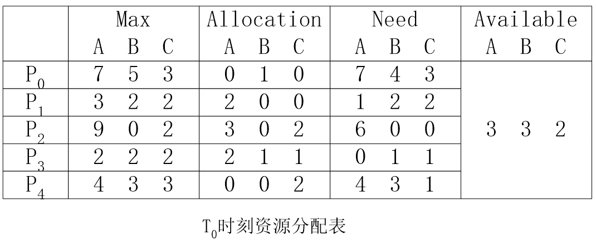
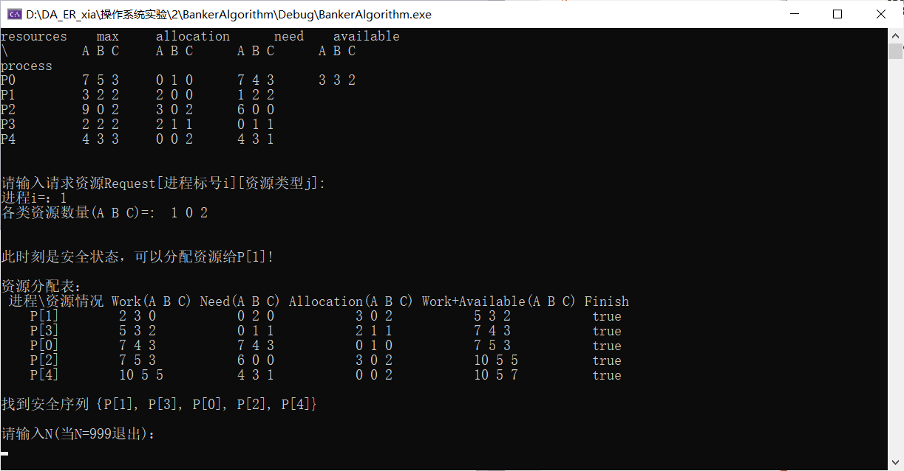
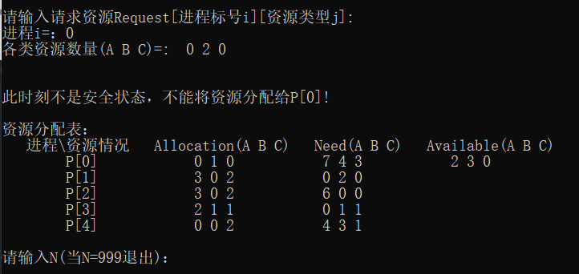
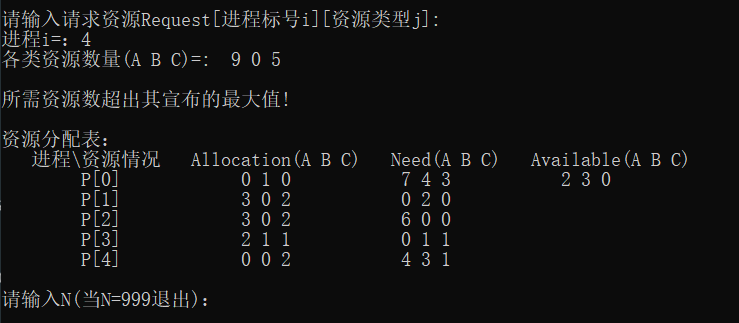
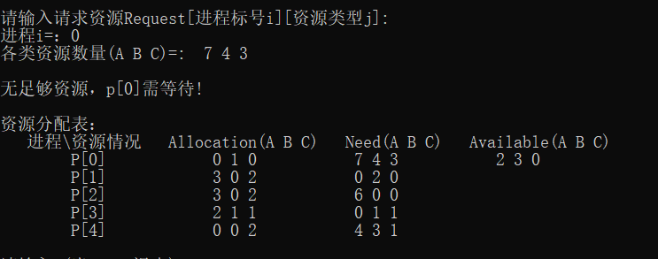

# <center>操作系统第三次实验报告<center>


<p align="right">58119304 朱启鹏</p>


## 1. 实验内容


- Write a multithreaded program that implements the banker's algorithm discussed in Section 7.5.3.Create n threads that request and releaseresources from the bank. The banker will grant the request only if itleaves the system in a safe state. You may write this program using either Pthreads or Win32 threads. It is important that access to shareddata is safe from concurrent access. Such data can be safely accessedusing mutex locks, which are available in both the Pthreads and Win32API.Coverage of rmutex locks in both of these libraries is described inproducer-consumer problem" project in Chapter 6.


## 2. 算法介绍


- #### Data Structures

  - Let n = number of processes, and m = number of resources types

  - ##### Available(可用资源向量):  

    - Vector of length m
    - If available [j] = k, there are k instances of resource type $R_j$  available
  - ##### Max(最大需求矩阵): 

    - n$\times$m matrix.  
    - If Max [i,j] = k, then process Pi may request at most k instances of resource type $R_j$

  - ##### Allocation(分配矩阵):  

    - n $\times$ m matrix.  
    - If Allocation[i,j] = k then Pi is currently allocated k instances of Rj

  - ##### Need(需求矩阵): 
    - n ⅹ m matrix. 
    - If Need[i,j] = k, then Pi may need k more instances of $R_j$ to complete its task
    - Need [i,j] = Max[i,j] – Allocation [i,j]
    
  - ##### Work(工作向量)
    - Vector of length m
    - If Work [j] = k, there are k instances of resource type $R_j$   after satisfying resource requests
  - ##### Finish(完成向量)
    - Vector of length n
    - If finish[i]=true, then Pi can finish successfully 
  - ##### Request(请求向量)
    - Vector of length n
    - If Request[j] = k, then process $P_x$ wants k instances of resource type $R_j$


- #### Safety Algorithm（安全状态检测算法）
  
  1. ##### Initialize:
  
    Work = Available
    Finish [i] = false for i = 0, 1, …, n- 1
  
  2. ##### Find an i such that both: 
  
    (a) Finish [i] = false
    (b) $Need_i$ $\le$ Work
    If no such i exists, go to step 4
  
  3. ##### Work = Work + $\text{Allocation}_i$     //$\text{P}_i$ 可以完成并释放资源 :Finish[i] = true.
  
     go to step 2
  
  4. If Finish [i] == true for all i, then the system is in a safe state. otherwise, the system is in an unsafe state.
  


- #### Resource-Request Algorithm

  1. If $Request_i \le Need_i$        go to step 2.  
     	Otherwise, raise error condition, since process has   exceeded its maximum claim
     2. If $Request_i \le Available$  go to step 3.  
     	Otherwise，$P_i$  must wait, since resources are not available
     3. Pretend to allocate requested resources to Pi by modifying the state as follows:
     		$Available = Available  – Request$
     		$Allocation_i = Allocation_i + Request_i$
     		$Need_i = Need_i – Request_i$
     4. invoke Safety Algorithm
     If safe $\Rightarrow$ the resources are allocated to $P_i $
     If unsafe $\Rightarrow$ $P_i$ must wait, and the old resource-allocation state is restored


## 3. 实验结果展示即分析

- 本次实验使用的数据如下

  - Initialization
    5 processes: ${P_0, P_1,P_2,P_3,P_4}$
    3 resource types: A (10 instances),  B (5 instances), and C (7 instances)
  - Snapshot at time $T_0$:
    $Need = Max – Allocation$



- 程序运行结果：

  - ###### 第一次请求：$Request_1=（1, 0, 2);$

    

  - 输入请求资源的进程编号和所需的资源数后，程序会自动给出对应的结果；
  - 若该请求能够被安全的满足，则输出安全退出的队列；
  
  
  
  - ###### 第二次请求：$Request_0=（0, 2, 0);$
  
  
  
  - 虽然$Request_i\le Need_i, Request_i\le Available_i$, 但经过资源分配算法会发现，加入将资源分配给1进程，将不是安全状态，所以不能将资源分配给$P_0$；
  
  
  
  - ###### 第三次请求：$Request_4=（9, 0, 5);$
  
  
  
  若请求资源数大于Need，则程序会提示请求资源数大于需要的资源数；
  
  
  
  - 第四次请求：$Request_0=（7, 4, 3);$
  
  
  - 由于$Request_i>Available$，此时无足够资源分配，所以需要等待


## 4. 代码附件

```
#include <iostream>
#include <fstream>

#define PROGRESS 5     //进程数量
#define REC_NUM  3     //资源种类数量

using namespace std;

//定义数据结构

int Available[PROGRESS];      //定义可用资源向量Available
int sign[PROGRESS], work[PROGRESS][REC_NUM], workAll[PROGRESS][REC_NUM];
//记录成功的安全序列,并定义工作矩阵和可用资源矩阵


int Max[PROGRESS][REC_NUM], Allocation[PROGRESS][REC_NUM], Need[PROGRESS][REC_NUM];
//定义最大需求矩阵Max，分配矩阵Allocation，需求矩阵Need


void Read_file();     //读取文件
int Banker_Algorithm(int, int[][REC_NUM]);       //银行家算法
int Safe_Algorithm(int[], int[][REC_NUM], int[][REC_NUM]);    //安全性算法
void Print_Run_Order(int);         //打印判断执行序列

//银行家算法
int Banker_Algorithm(int i, int Request[][REC_NUM]) {
    for (int m = 0; m < REC_NUM; m++) {
        if (Request[i][m] > Need[i][m]) {
            cout << "所需资源数超出其宣布的最大值!" << endl;
            return 0;
        }
        else if (Request[i][m] > Available[m]) {
            cout << "无足够资源，p[" << i << "]需等待!" << endl;
            return 0;
        }
    }

    //尝试为进程分配资源
    for (int j = 0; j < REC_NUM; j++) {
        Available[j] = Available[j] - Request[i][j];
        Allocation[i][j] = Allocation[i][j] + Request[i][j];
        Need[i][j] = Need[i][j] - Request[i][j];
    }

    //执行安全性算法
    int n = Safe_Algorithm(Available, Need, Allocation);
    cout << endl;

    if (n == PROGRESS) {//有5个'true'返回1，表示此时刻安全
        cout << "此时刻是安全状态，可以分配资源给" << "P[" << i << "]!" << endl;
    }
    else {

        //把给进程P[i]分配过的资源还给系统
        for (int j = 0; j < REC_NUM; j++) {
            Available[j] = Available[j] + Request[i][j];
            Allocation[i][j] = Allocation[i][j] - Request[i][j];
            Need[i][j] = Need[i][j] + Request[i][j];
        }
        cout << "此时刻不是安全状态，不能将资源分配给" << "P[" << i << "]!" << endl;
    }
    return n;
}


//读取文件数据，打印到控制台，并将数据存入到相应矩阵中
void Read_file() {
    //读取完整文件并打印
    ifstream inFile1("Alldata.txt", ios::in);  //创建文件流对象
    if (!inFile1)      //判断对象inFile打开文件成功与否
        cerr << "File open error." << endl;  //使用错误流对象输出错误信息
    else {
        char c;
        while ((c = inFile1.get()) != EOF)  //按字符读取文件内容，到达末尾停止
            cout << c;
        cout << endl;
        inFile1.close();
    }

    //读取只有数字的文件并存入矩阵中
    ifstream inFile2("data.txt", ios::in);
    if (!inFile2)
        cerr << "File open error." << endl;
    else {
        int data;
        //读取数字并存入矩阵
        for (int j = 0; j < PROGRESS; j++) {
            for (int i = 0; i < REC_NUM; i++) {
                inFile2 >> data;
                Max[j][i] = data;
            }
            for (int i = 0; i < REC_NUM; i++) {
                inFile2 >> data;
                Allocation[j][i] = data;
            }
            for (int i = 0; i < REC_NUM; i++) {
                inFile2 >> data;
                Need[j][i] = data;
            }
            if (j == 0) {
                for (int i = 0; i < REC_NUM; i++) {
                    inFile2 >> data;
                    Available[i] = data;
                }
            }
        }
        inFile2.close();
    }
}

//安全性算法
int Safe_Algorithm(int Available[], int Need[][REC_NUM], int Allocation[][REC_NUM]) {
    int i = 0, j = 0, m = 0, n = 0;
    int Work[REC_NUM], Finish[PROGRESS] = { 0,0,0,0,0 };
    for (int r = 0; r < REC_NUM; r++) //将可用资源数目赋给工作向量Work
        Work[r] = Available[r];
    while (i < PROGRESS) {
        if (Finish[i] == 0) {
            //满足条件释放资源，并从头开始扫描进程集合
            while (j < REC_NUM && Need[i][j] <= Work[j])
                j++;
            if (j == REC_NUM) {
                for (int k = 0; k < REC_NUM; k++) {
                    work[i][k] = Work[k];
                    Work[k] = Work[k] + Allocation[i][k];
                    workAll[i][k] = Work[k];
                }
                Finish[i] = 1;
                sign[m] = i;  //保存安全序列
                i = -1; m++;
            }
        }
        j = 0; i++;
    }
    for (int p = 0; p < PROGRESS; p++) {
        if (Finish[p] == 1)
            n++;   //记录'true'个数
    }
    return n;     //返回'true'个数
}

//打印安全性检查的执行序列
void Print_Run_Order(int result) {
    if (result == PROGRESS) {
        cout << " 进程\\资源情况" << " Work(A B C)" << " Need(A B C)"
            << " Allocation(A B C)" << " Work+Available(A B C)" << " Finish";
        cout << endl;
        for (int i = 0; i < PROGRESS; i++) {
            cout << "    " << "P[" << sign[i] << "]  " << '\t';
            for (int j = 0; j < REC_NUM; j++)
                cout << work[sign[i]][j] << " ";
            cout << '\t' << '\t';
            for (int j = 0; j < REC_NUM; j++)
                cout << Need[sign[i]][j] << " ";
            cout << '\t' << '\t';
            for (int j = 0; j < REC_NUM; j++)
                cout << Allocation[sign[i]][j] << " ";
            cout << '\t' << '\t';
            for (int j = 0; j < REC_NUM; j++)
                cout << workAll[sign[i]][j] << " ";
            cout << '\t' << '\t';
            cout << "true" << endl;
        }
        cout << endl << "找到安全序列｛P[" << sign[0] << "]";
        for (int m = 1; m < PROGRESS; m++) {
            cout << ", P[" << sign[m] << "]";
        }
        cout << "}" << endl;
    }
    else {
        cout << "   进程\\资源情况 " << "  Allocation(A B C)" << "   Need(A B C)" << "   Available(A B C)";
        cout << endl;
        for (int k = 0; k < 5; k++) {
            cout << '\t' << "P[" << k << "]" << '\t' << '\t';
            for (int j = 0; j < 3; j++)
                cout << Allocation[k][j] << " ";
            cout << '\t' << '\t';
            for (int j = 0; j < 3; j++)
                cout << Need[k][j] << " ";
            cout << '\t' << '\t';
            if (k == 0) {
                for (int j = 0; j < 3; j++)
                    cout << Available[j] << " ";
            }
            cout << endl;
        }
    }
}

int main()
{
    //读取文件数据并打印,然后将数据存入到相应矩阵中
    Read_file();

    //任务开始
    int i, N = 0;    // 'N'表示请求资源次数
    int Request[PROGRESS][REC_NUM];  //定义请求矩阵Requset
    while (N != 999) {
        cout << endl << "请输入请求资源Request[进程标号i][资源类型j]:" << endl;
        cout << "进程i=：";
        cin >> i;
        cout << "各类资源数量(A B C)=:  ";
        for (int m = 0; m < REC_NUM; m++)
            cin >> Request[i][m];
        cout << endl;
        //执行银行家算法
        int result = Banker_Algorithm(i, Request);
        //输出每次判断产生的执行序列
        cout << endl << "资源分配表：" << endl;
        Print_Run_Order(result);
        cout << endl << "请输入N(当N=999退出)：" << endl;
        cin >> N;
    }
}


```

